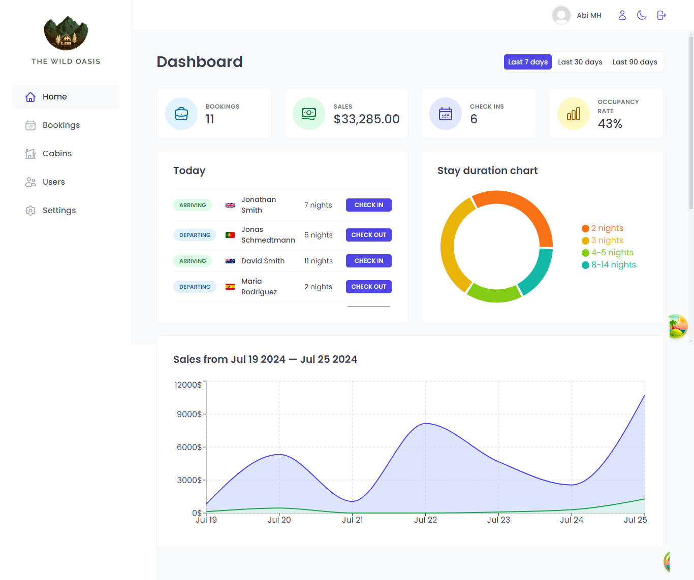
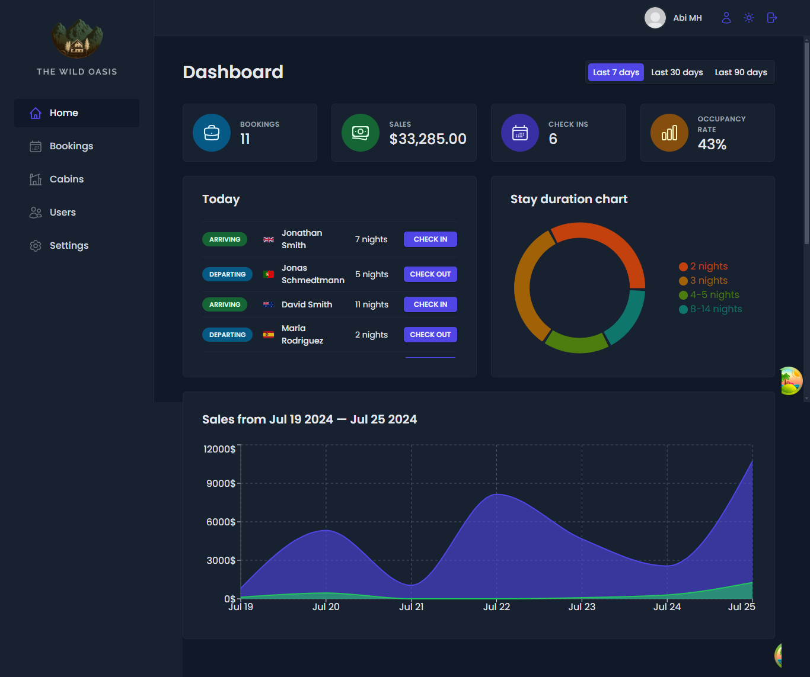

# The Wild Oasis

This project based on React Udemy Course by Jonas Schmedtmann. [(Master modern React from beginner to advanced! Next.js, Context API, React Query, Redux, Tailwind, advanced patterns)](https://www.udemy.com/course/the-ultimate-react-course/)

## List of Contents

- [Overview](#overview)
  - [The challenge](#the-challenge)
  - [Screenshot](#screenshot)
  - [Links](#links)
- [My process](#my-process)
  - [Built with](#built-with)
  - [What I learned](#what-i-learned)
  - [Useful resources](#useful-resources)
- [Author](#author)

## Overview

### About the Project

The Wild Oasis is Hotel Management System App. It provides a comprehensive solution for managing cabins, bookings, guests, and various operational tasks. This application ensures that only hotel employees can access and perform tasks by implementing an internal sign-up system. Key features include a dashboard for displaying important metrics, table views for cabins and bookings, and functionalities for updating, deleting, and creating new records.

### Screenshot

**Desktop View**

### Links

- Solution URL: [Solution Code](https://github.com/abimh66/the-wild-oasis)
- Live Site URL: [Live Site](https://the-wild-oasis-abimh66.netlify.app/)

## My process

### Built with

- ReactJS
- React Router
- React Hook Form
- React Query
- Supabase
- Styled components

### What I learned

Working on this project, I gained valuable experience in several areas:

- **Project Planning:** Improved my skills in planning and organizing the project workflow, ensuring a systematic approach to development.
- **React Router:** Learned how to implement routing in React applications, enabling smooth navigation between different components and views.
- **React Hook Form:** Utilized React Hook Form to manage form state and validation efficiently within React applications.
- **TanStack React Query:** Mastered the use of React Query to manage remote/server state, providing a robust solution for data fetching and synchronization.
- **Supabase:** Gained hands-on experience with Supabase for handling backend services and user authentication, leveraging its real-time capabilities.
- **Styled Components:** Enhanced my ability to apply CSS-in-JS using Styled Components, allowing for scoped and maintainable styling within React components.

### Resources

- [React Documentation](https://react.dev/reference/react)
- [React Router v6.4+ Documentation](https://reactrouter.com/en/main/start/overview)
- [React Hook Form Documentation](https://react-hook-form.com/get-started)
- [TanStack React Query v5 Documentation](https://tanstack.com/query/latest/docs/framework/react/overview)
- [Supabase JavaScript Documentation](https://supabase.com/docs/reference/javascript/introduction)

## Author

- Twitter - [@abimhrdnt](https://www.twitter.com/abimhrdnt)
- Frontend Mentor - [@abimh66](https://www.frontendmentor.io/profile/abimh66)
- Codewars - [@abimh66](https://www.codewars.com/users/abimh66)
